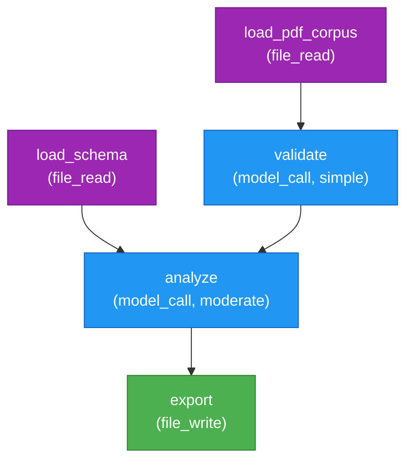

# Hillstar Orchestrator v1.1.0


<p align="center">
  <a href="https://doi.org/10.5281/zenodo.18829921"></a>
  <a href="https://github.com/evoclock/hillstar-orchestrator/actions/workflows/docs.yml"></a>
  <a href="https://pypi.org/project/hillstar-orchestrator/"></a>
  <a href="LICENSE"></a>
  
</p>

**[PyPI](https://pypi.org/project/hillstar-orchestrator/)** | **[API Documentation](https://evoclock.github.io/hillstar-orchestrator/)** | **[User Manual](https://github.com/evoclock/hillstar-orchestrator/blob/main/docs/User_Manual.md)** | **[Setup Guide](https://github.com/evoclock/hillstar-orchestrator/blob/main/docs/SETUP_GUIDE.md)**

## A security and reproducibility-first workflow orchestration tool

Hillstar is an open-source workflow orchestrator built for scientific research labs and any environment where reproducibility and auditability are non-negotiable. Most worflow management tools in this space are designed for data/software engineering teams. Hillstar keeps the underlying rigor, but is built for researchers, analysts, and teams in regulated environments who need to prove what happened, when, and why—without requiring a background in DevOps.

Hillstar is designed with auditability, security, and governance as first-class concerns, so it fits naturally in tightly regulated environments.

The core design principle: explicit over implicit. No unrestricted API access. No magic. You define workflows as composable DAGs where each node performs one action and data flows explicitly between stages. Every decision is auditable: which model was called, what parameters were used, how much it cost, whether review was required before the output moved downstream.

This matters in environments where highly sensitive data is in use—teams working with human genomic data, clinical trials, or proprietary research—where governance isn't a nice-to-have, it's the foundation. Hillstar bakes in compliance checking, credential security, and comprehensive logging from the start.

Whether you are coordinating between multiple large language model (LLM) providers, integrating with custom or external agents via MCP servers, or running everything locally and offline, the same auditability guarantees apply.

---

## Current Features (v1.1.0)

- **DAG-based workflows** - Define complex research pipelines as
 directed acyclic graphs
- **Workflow visualization** - Mermaid diagrams for GitHub, Obsidian,
 and Markdown
- **Multi-provider support** - Integration with cloud and local models
- **Flexible model selection** - Presets for cost, quality, and
 air-gapped setups
- **Full auditability** - Comprehensive trace logs with model selection
 reasoning
- **Checkpoint/replay** - Save state at key points, resume from
 checkpoints
- **Strict governance** - Explicit permissions, no unrestricted API
 access
- **Air-gapped capability** - Works offline with local models
- **Responsible AI focus** - Explicit governance, compliance tracking,
 and audit trails
- **Credential Security** - In-flight redaction of credentials, API
 keys, tokens, and PII
- **MCP Server Support** - Optional MCP servers for integration with
 Claude Code and other tools
- **Agent security scanning** - Static `agent-scan` of MCP configs and
 skill files (hardcoded secrets, injection, dangerous flags)

---

## Quick Start

### Installation & Setup

```bash
# Clone repository
git clone git@github.com:evoclock/hillstar-orchestrator.git
cd hillstar-orchestrator

# Install Hillstar
pip install -e .

# Verify installation
hillstar --version

# List available workflows
hillstar discover .
```

### Run a Workflow

Create a workflow file or use the test example:

```bash
# Validate a workflow
hillstar validate examples/simple-workflow.json

# Execute
hillstar execute examples/simple-workflow.json
```

See **[docs/User_Manual.md](https://github.com/evoclock/hillstar-orchestrator/blob/main/docs/User_Manual.md)** for step-by-step
examples of building workflows.

Output:

```markdown
▶ Executing: examples/simple-workflow.json
📁 Output: ./.hillstar

 Workflow executed successfully

 Workflow ID: sample_workflow
 Trace file: .hillstar/trace_20260221_031505.jsonl
```

### Governance & Development Mode

Hillstar enforces workflow-driven commits to ensure reproducibility.
Three options:

#### Option 1: Execute a workflow, then commit (recommended)

```bash
hillstar execute workflow.json
git commit -m "[Fix] Bug fix with recent workflow"
# Success: Workflow execution marker allows commit
```

#### Option 2: Enable development mode for code-only work

```bash
# Toggle persistent development mode
hillstar mode dev
git commit -m "[Docs] Update README"
git commit -m "[Refactor] Clean up imports"

# Re-enable enforcement
hillstar mode normal
```

#### Option 3: One-time overrides

```bash
# Via environment variable
HILLSTAR_DEV_MODE=1 git commit -m "[Docs] Fix typo"
```

---

## Architecture

### Graph Execution Engine

Workflows are directed acyclic graphs (DAGs). Nodes execute in
topological order.

**Example DAG visualization:**



**Color Legend:**

- 🔵 **Blue** = model_call (AI/ML operations)
- 🟣 **Purple** = file_read (data input)
- 🟢 **Green** = file_write (data output)
- 🟠 **Orange** = script_run (custom operations)

### Workflow Structure

Complete workflows require root-level configuration with DAG nodes:

```json
{
 "id": "my_pipeline",
 "version": "1.0",
 "graph": {
 "nodes": {
 "analyze": {
 "tool": "model_call",
 "provider": "anthropic",
 "model": "claude-opus-4-6",
 "task": "Analyze data",
 "parameters": {
 "max_tokens": 4096
 }
 },
 "validate": {
 "tool": "script_run",
 "script": "./validate.py"
 }
 },
 "edges": [
 { "from": "analyze", "to": "validate" }
 ]
 },
 "provider_config": {
 "anthropic": {
 "tos_accepted": true,
 "audit_enabled": true,
 "restricted_use_acknowledged": true
 }
 }
}
```

### Model Integration

**Supported providers:**

- **Cloud APIs**: Anthropic (Claude), OpenAI (GPT), Mistral,
 Google (Gemini)
- All use API keys/credentials (never embedded in workflows)
- **Local Models**: Ollama, llama.cpp, Devstral, Jan-Code, or any
 HTTP-compatible server
- **Custom Providers**: Bring your own via wrapper scripts
- **Subscription mode**: OpenAI only. Unlike Anthropic, OpenAI has decided to support access and usage of your subscription via third party harnesses/tools. A caveat worth mentioning is that if you are developing software, you should default to Cloud APIs for reliability.

**Further information on subscription mode support can be found through the following links:**

- **[docs/MCP_TOPOLOGY.md](https://github.com/evoclock/hillstar-orchestrator/blob/main/docs/MCP_TOPOLOGY.md)**
- **[docs/OPENAI_HILLSTAR_SETUP.md](https://github.com/evoclock/hillstar-orchestrator/blob/main/docs/OPENAI_HILLSTAR_SETUP.md)**

**Model specification in workflows:**

```json
{
 "tool": "model_call",
 "provider": "anthropic",
 "model": "claude-opus-4-6",
 "parameters": {
 "system": "You are an expert in ...",
 "max_tokens": 4096
 }
}
```

**Parameter Support Varies by Model:**

Check model constraints before setting sampling parameters:

- **Anthropic Claude**: Cannot use `temperature` and `top_p`
 simultaneously
- **OpenAI o-series & GPT-5**: Do not support `temperature` (use
 `reasoning_effort` instead)
- **Google Gemini 3**: Keep `temperature` at default (1.0) to avoid
 performance issues

See **[docs/PROVIDER_MODEL_REFERENCE.md](https://github.com/evoclock/hillstar-orchestrator/blob/main/docs/PROVIDER_MODEL_REFERENCE.md)**
for complete constraints by model and provider.

### Model Selection & Presets

Hillstar provides flexible model selection with four preset strategies:

**Four Built-in Presets**:

- `minimize_cost` - Cheapest models per complexity level
- `balanced` - Mix of cost and quality
- `maximize_quality` - Highest quality models regardless of cost
- `local_only` - Air-gapped: Local models only (no cloud APIs)

---

## Security Scanning

Hillstar can statically scan MCP server configurations and agent skill
files for security issues before you wire them into a workflow:

```bash
# Scan a single MCP config, a skill file, or a whole directory
hillstar agent-scan ~/.claude.json
hillstar agent-scan ./skills/
hillstar agent-scan ./config --severity medium   # raise the threshold
hillstar agent-scan ./config --json              # machine-readable output
```

The scanner flags hardcoded secrets, shell-injection vectors, dangerous
launch flags, and unencrypted endpoints in MCP configs, and
prompt-injection, data-exfiltration, and destructive-command patterns in
skill files. Findings are graded `info`, `low`, `medium`, `high`, and
`critical`; `--severity` sets the minimum reported (default `low`). The
command exits non-zero when any `high` or `critical` finding is present,
so it can gate CI.

See **[docs/User_Manual.md](https://github.com/evoclock/hillstar-orchestrator/blob/main/docs/User_Manual.md)**
for the full command reference.

---

## Workflow Schema

See `spec/workflow-schema.json` for complete schema.

**Nodes:**

- `model_call` - Call an LLM
- `file_read` - Read a file
- `file_write` - Write output
- `script_run` - Execute a script
- `checkpoint` - Save workflow state

---

## Values Statement

**Our Design Philosophy**: As Meredith Whittaker warns in ["AI agents
are coming for your privacy"](https://www.economist.com/by-invitation/2025/09/09/ai-agents-are-coming-for-your-privacy-warns-meredith-whittaker), unconstrained AI
agents pose significant privacy and autonomy risks. Hillstar is designed
with explicit permissions, auditability, and governance boundaries to
prevent systems operating with unrestricted access to user data and
external systems.

**NOT Supported (no exceptions):**

- xAI (Groq/Grok)
- Palantir

---

## Development

### Project Structure

```bash
hillstar-orchestrator/
├── README.md # This file
├── LICENSE # AGPLv3
├── requirements.txt # Python dependencies
├── pyproject.toml # Package configuration
├── .gitignore
│
├── cli.py # Command-line interface
│
├── config/ # Configuration management
│ ├── config.py
│ ├── config_manager.py
│ ├── model_selector.py
│ ├── provider_registry.py
│ └── provider_registry.default.json
│
├── execution/ # Workflow execution engine
│ ├── runner.py # Main orchestration
│ ├── node_executor.py # Node execution and provider chains
│ ├── model_selector.py # Model selection and fallback logic
│ ├── cost_manager.py # Cost tracking and budget enforcement
│ ├── config_validator.py # Configuration validation
│ ├── graph.py # DAG execution with topological ordering
│ ├── checkpoint.py # Checkpoint persistence
│ ├── trace.py # Execution tracing
│ └── observability.py # Comprehensive logging
│
├── governance/ # Compliance & policy
│ ├── compliance.py
│ ├── policy.py
│ ├── enforcer.py
│ ├── hooks.py
│ └── project_init.py
│
├── models/ # LLM provider integrations
│ ├── mcp_model.py
│ ├── anthropic_model.py
│ ├── anthropic_mcp_model.py
│ ├── anthropic_ollama_api_model.py
│ ├── openai_mcp_model.py
│ ├── mistral_api_model.py
│ ├── mistral_mcp_model.py
│ ├── ollama_mcp_model.py
│ └── devstral_local_model.py
│
├── workflows/ # Workflow discovery & validation
│ ├── validator.py
│ ├── discovery.py
│ ├── auto_discover.py
│ └── model_presets.py
│
├── utils/ # Utility functions
│ ├── credential_redactor.py
│ ├── exceptions.py
│ └── report.py
│
├── spec/ # Workflow JSON schema
│ └── workflow-schema.json
│
├── tests/ # Unit tests
│ ├── test_credential_redactor.py
│ ├── test_integration.py
│ ├── test_mcp_error_handling.py
│ └── test_workflow_execution.py
│
├── examples/ # Example workflows
│ ├── simple-workflow.json
│ └── multi-provider-workflow.json
│
├── docs/ # User documentation
│ ├── INSTALLATION.md
│ ├── QUICK_START.md
│ ├── USER_MANUAL.md
│ ├── PROVIDER_MODEL_REFERENCE.md
│ └── PROVIDER_SETUP.md
│
└── mcp-server/ # MCP server implementations
 ├── anthropic_mcp_server.py
 ├── openai_mcp_server.py
 ├── mistral_mcp_server.py
 └── ... (other MCP servers)
```

### Local Development

```bash
# Clone and install
git clone git@github.com:evoclock/hillstar-orchestrator.git
cd hillstar-orchestrator

# Install in editable mode
pip install -e .

# Verify installation
hillstar --version

# Explore workflows
hillstar discover .

# Run test suite
pytest tests/ -v
```

---

## Troubleshooting

### API Key Issues

#### Error: "ANTHROPIC_API_KEY not found"

```bash
# Set your API key (replace with actual key)
export ANTHROPIC_API_KEY="sk-ant-..."

# Or use the interactive setup wizard
hillstar wizard
```

#### Error: "No valid credentials found for provider X"

- Verify the env var is set: `echo $PROVIDER_API_KEY`
- Check provider name spelling in workflow (e.g., `anthropic` not
 `claude`)
- Run `hillstar wizard` to validate and save credentials

### Model Issues

#### Error: "Unsupported parameter: 'temperature' not supported..."

- Model does not support temperature (o3, o3-mini, GPT-5 series)
- See **[docs/PROVIDER_MODEL_REFERENCE.md](https://github.com/evoclock/hillstar-orchestrator/blob/main/docs/PROVIDER_MODEL_REFERENCE.md)**
 for constraints
- Remove temperature from parameters, or use a different model

#### Error: "Model not found" or "Model not accessible"

- Verify model name matches provider's documentation
- Check provider registry: `hillstar presets` shows available models
- Ensure API key has access to the model (some are restricted)

### Workflow Validation

#### Error: "Invalid workflow schema"

```bash
# Validate workflow with verbose output
hillstar validate workflow.json --verbose

# Check against schema
cat spec/workflow-schema.json
```

### Getting Help

```bash
# Show available commands
hillstar --help

# Get help for specific command
hillstar execute --help

# Check system compliance
hillstar enforce status

# View logs
ls .hillstar/
```

---

## Why Hillstar?


The name is inspired by the *Chimborazo Hillstar*, a hummingbird
endemic to Ecuador's High Andes. [Recent research (Cañas-Valle &
Bouzat, 2025)](https://academic.oup.com/auk/article/142/2/ukae063/7912599)
has revealed remarkably unique behaviour among these hummingbirds: while
the majority of hummingbirds are fiercely territorial, Chimborazo
Hillstars engage in colonial nesting, practice cooperative roosting, and
live together peacefully. They share information about resources,
coordinate on survival strategies, and adapt fluidly to their
environmental constraints.

---

## License and provider terms

Hillstar is free software licensed under the GNU Affero General Public License v3.0 (AGPLv3), together with the additional author-attribution terms set forth under Section 7(b) in the LICENSE file at the repository root. See that file for the full text.

Hillstar was designed by Julen Gamboa. All copies, modified versions, and derivative works must preserve attribution to the original author, and any user-facing primary documentation must link to the upstream repository at https://github.com/evoclock/hillstar-orchestrator (Section 7(b)).

A commercial licence that waives the AGPLv3 obligations (including the Section 13 network-use source-disclosure requirement and the Section 7(b) attribution terms) is available for users who cannot or do not wish to comply with the AGPLv3. Contact the author for details.

Running API calls through Hillstar does not grant any rights or warranties regarding each API provider's Terms of Service. The operator of Hillstar is responsible for complying with each API provider's Terms of Service.

---

## Citation

If you use Hillstar Orchestrator in research, please cite:

```bibtex

@software{gamboa2026hillstar,
 title={Hillstar Orchestrator v1.1.0},
 author={Gamboa, Julen},
 year={2026},
 doi={10.5281/zenodo.18829921},
 url={https://doi.org/10.5281/zenodo.18829921}
}
```

---

## Status

🟢 **v1.1.0 Release** (Jun 28, 2026) - Builds on the v1.0.0 production
engine with an agent security scanner, expanded local-model providers, and a
licence change to AGPLv3.

**New in v1.1.0:**

- **Agent security scanning** - `agent-scan` statically checks MCP configs
 and skill files for hardcoded secrets, injection, dangerous flags, and
 data-exfiltration patterns
- **Expanded local providers** - Ollama over its HTTP API, plus the Jan-Code
 4B local model via llama.cpp
- **Documented resilience** - Provider retry/backoff policy (3 retries at
 30/60/120s) surfaced in the setup guide
- **Licence** - Relicensed to AGPLv3 with Section 7(b) attribution terms

**v1.1.0 Capabilities:**

- **Multi-provider access** - Anthropic, OpenAI, Mistral, Google cloud
 APIs; local models (Ollama, llama.cpp, Devstral, Jan-Code); MCP servers
- **Smart model selection** - Four cost/quality presets or explicitly
 choose any model
- **Safe parameters** - Model constraints auto-documented with helpful
 errors before execution
- **Workflow governance** - Three commit modes: require workflow
 execution (default), dev mode, or one-time override
- **Secure credentials** - Automatic credential redaction in logs/errors;
 never embedded in workflows
- **Agent security scanning** - Static analysis of MCP configs and skill
 files before they enter a workflow
- **Workflow visualization** - Mermaid DAG diagrams; topological
 execution order visible
- **Checkpoint/replay** - Resume from saved state; audit trail of
 execution
- **Air-gapped ready** - Run entirely offline with local models
- **Workflow discovery & validation** - Auto-find and validate workflows
 before execution

**v1.1.0 Test & Quality Metrics:**

- **1,117 tests** - 100% pass rate
- **83% line coverage** - Project-wide (`pytest --cov=.`)
- **Credential security** - 24 pattern types detected and redacted
- **MCP integration** - 7 MCP servers validated and tested
- **Performance** - Topological DAG execution with intelligent fallback chains

**Future Releases (v2.0+):**

- Advanced safety guards for complex testing infrastructure
- SDK integration for token counting and real-time pricing
- Extended provider support (Vertex AI, additional local models)
- Plugin system and extensibility
- Web UI for workflow visualization and management
- Distributed execution across multiple machines

---
